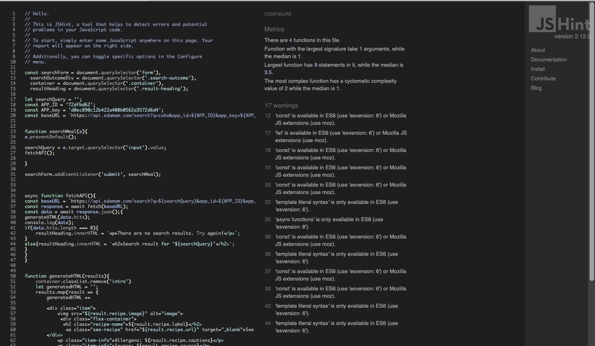

  

<h1>Table of content:</h1>

1. Description
2. Deployment and Demo
3. Wireframe
4. UX
5. Visual Identity
6. User Stories
7. Testing
8. Features for futer implementation
9. Technologies
10. Media
11. Thanks to:

# 1. Description

*This is a Meal Finding APP*

> Meal Finding App is all about fantastic food recipes generated instantly, providing you not only wwith pictures,
 ingridients list, methods, allergens and calories but also with wide macronutrient data for those with 
 special reqirements in terms of diet or performance. 

# 2. Deployment and Demo

Website has been deployed to [GitHub Pages](https://miszamm.github.io/MS2/).

The process for deployment is documented below:

Log into GitHub

Access the page with the repository for this project (https://miszamm.github.io/MS2/)

Click on 'Settings' on the main menu over the file listing

Navigate down to 'GitHub Pages'

Select 'Branch: Master' from the menu

This generates a live link for the website, which is now viewable publicly

# 3. Wireframe

The wireframe was designed using [Balsamiq](https://balsamiq.com/) and links to the final version can be found below:

- 

- 

# 4. UX/UI

I have opted to a simple and responsive design which is lightweight and has a loading time of around 0.6 second.

- Home Page with minimalistic design contains body with logo div, and main section, with single colour background, and picture of food 
  in the center off the viewport to contrast the background colour. Main Page is responsive despite the size of the device. Animated search form with button is located above the main photo. 
  Name of the app placed above search form as expected.

- Once search form is filled in and button pressed, than main foto is removed and replaced with data recieved from Api, and search-outcome is 
  dispalay in the viewport by using css grid template to define grid columns and rows. 

- API used comes from [EDAMAM](https://developer.edamam.com/) and contains in it's data base almost 2 milion recipes. 
  As a developer you are allow free access, with 5 requests form API per minute.

- Displayd data contains an image of searched meal or ingriedient and additional dietary informations. 

- For a full recipe and method user would be redirected to the original page by pressing a button "see recipe" located on the right side below the picture from generated HTML.

- For better user experience if the data is not find, script.js will generate alert to retype search value.

In order to improve user experience and website loading speed, I have compressed the images using [tinypng.com](https://tinypng.com/) and the reduction in image size has been 51%.

# 5. Visual Identity

- [Free Logo Design](http://freelogodesign.org) website was used for the logo design and stationary

# 6. User Stories

Users:

- As a user, I'd like to find meals from different parts of the world,
- As a user, I'd like to get inspiration or new ideas for meal preping
- As a user, I'd like to get dietary informations about products or meals
- As a user, I'd like to find nutrition values of the food to improve  myperformance in sport
- As a user, I'd like to get nutritional guidlines  

Meal Finder App owner:

- As a business owner, I'd like to list other services in the site
- As a business owner, I'd like to receive legal advice on certain issues
- As a business owner, I'd like to access the members area
- As a business owner, I'd like to connect with other businesses in my area, or globaly

# 7. Testing

This project has been tested throughout with use of preview, devtools, manual testing and also the website was deployed on github pages very early in development to allow 
live testing after each commit was made.

Website has been tested using [GTmetrix](https://gtmetrix.com/reports/miszamm.github.io/6bZo7r2F) and
[W3C CSS Validator](https://jigsaw.w3.org/css-validator/validator?uri=https%3A%2F%2Fmiszamm.github.io%2FMS2%2F&profile=css3svg&usermedium=all&warning=1&vextwarning=&lang=en#css), 
see results below:

<h2>Java Script</h2>

All function's in Java Script were tested manually via console.log & dev tools through my IDE's Live preview. 
On top of that further testing was done by pushing functions live to my deployed page to see if any issues appeared on the live version,
or if any of the functions caused issues with each other. By combining above manual testing methods i was able to discover issues with "if" and "else" conditional statemnents,
and major issues wiith fetching API during early stages  of development process. In the last phase of development JavaScript code was tested with 
[JSHINT](https://www.google.com/url?sa=t&rct=j&q=&esrc=s&source=web&cd=&cad=rja&uact=8&ved=2ahUKEwiPyuWrxfvsAhXzThUIHQooDa4QFjAAegQIARAD&url=https%3A%2F%2Fjshint.com%2F&usg=AOvVaw02nxzQ6lFZ_w2Jgaj85bvT),
see result below. I've got several warnings two of which were for missing semicolon and the rest for using ES6 and higher, this means that code will work on all browsers except Internet Explorer, which is acceptable.

<h2>Responsive Test</h2>

For the responsive test i used an app called [Responsivley App](https://responsively.app/) which allowed me to view my website with multiple device sizes 
(iPhone 5/5se 320px, iPhone X 375px, Ipad 768px, and a generic laptop size of 1280px) . Additionally responsivnes was also tested fully on Gitpod IDE previev option
with use of devtools during whole development process, and also page deployd on github didn't show any issues with view ports listed below: (320px, 375px, 414px, 768px, 1024px, 1440px, 1920px)

# 8. Features for future implementation

If in the future I was to continue of development of this project, I would  definitely add: 

- navbar 
- modal to display all macronutrients 
- additional page with login where you can create your favorite recipe data base 
- additional function to sort meals for different groups for example: vegan, fish, low sugar etc.
- add function to generate meals based on the list of ingridients
- add api and function to generate weekly menu based on daly calorific requiremnts
- contact info

# 9. Technologies
- [HTML](https://html.com/)
- [CSS](https://developer.mozilla.org/en-US/docs/Web/CSS)
- [JavaScript](https://www.javascript.com/)
- [jQuery](https://jquery.com/)
- [Font Awesome](https://www.google.com/search?q=font+awesome&oq=&sourceid=chrome&ie=UTF-8)
- [Google Fonts](https://www.google.com/search?q=google+fonts&oq=google+fonts&aqs=chrome..69i57j35i39j0l6.5569j0j7&sourceid=chrome&ie=UTF-8)

# 10. Media

I have used different resources for images and my logo, I'll list all below:

- [Free Logo Design](http://freelogodesign.org) for the logo design and stationary
- [Unsplash](https://unsplash.com) for all the images
- [Font Awesome](https://fontawesome.com/6?next=%2Fstart) for the amazing icons used on this site
- [Am I Responsive](http://ami.responsivedesign.is/) for the cool image in the UX section
- [MDN Web Docs](https://developer.mozilla.org/en-US/) for technical suport

# 11. Thanks to:
- Gitpod Since I am typing this text through Gitpod. All code was created through Gitpod and the workspace for this project resides there.
- GitHub which is used to host and deploy the project
- Font awesome community for developing this great resource
- Bootstrap crew for developing and maintaining such great library although in the end i didn't use it
- jQuery developers for all the work and great documentation
- Free Logo Design for the great service
- Unsplash.com for the wonderful pictures
- Microsoft for developing VScode and providing it free of charge
- Brooke Lark and Dan Gold for taking andsharing great photos 
- EDAMAM for allowing use of their API for the project 
- Traversy Media, Academind, and Dark Code for sharing their proffesional knowledge
- Code Institute team: the other students on Slack
- Last but not least my mentor Felipe Souza Alarcon for his constant support, and proffesional advice

