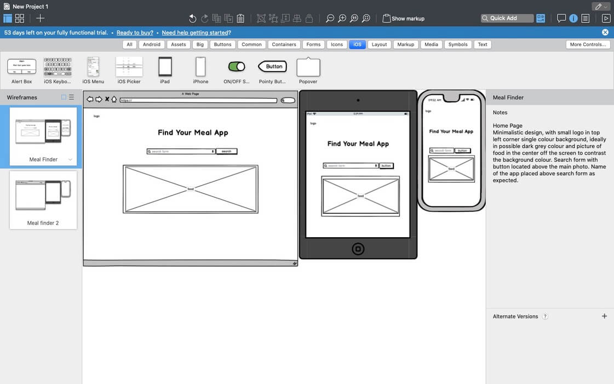
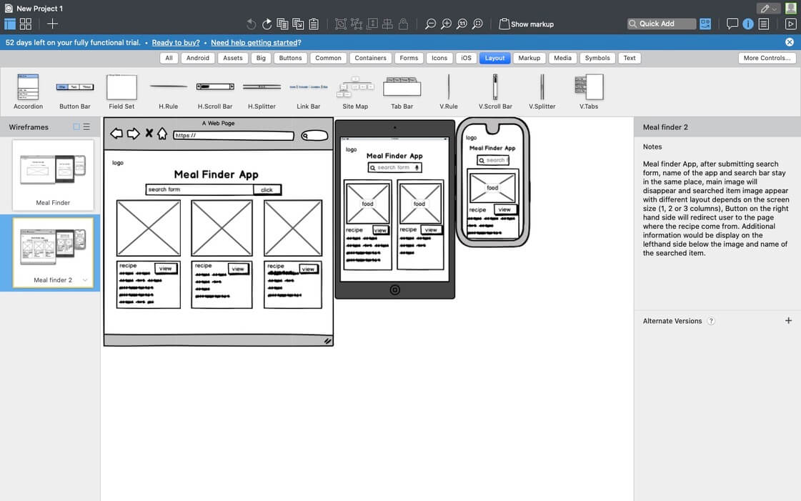
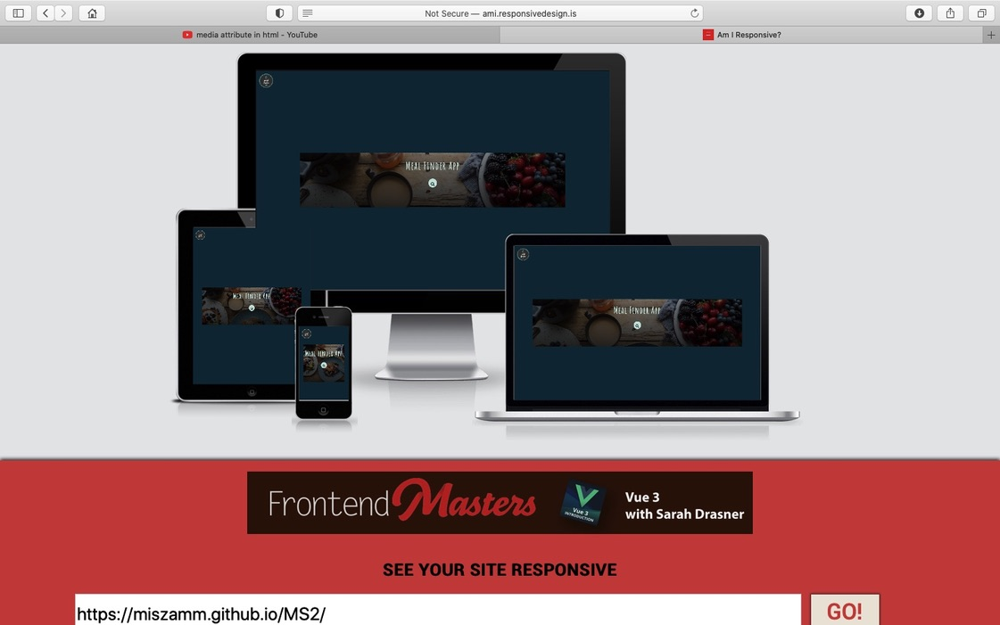
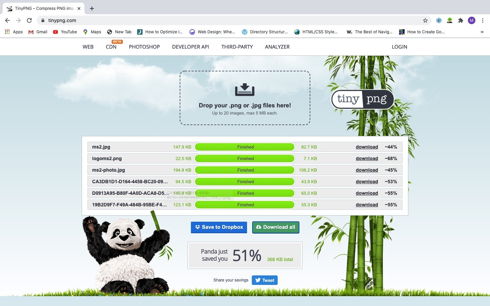
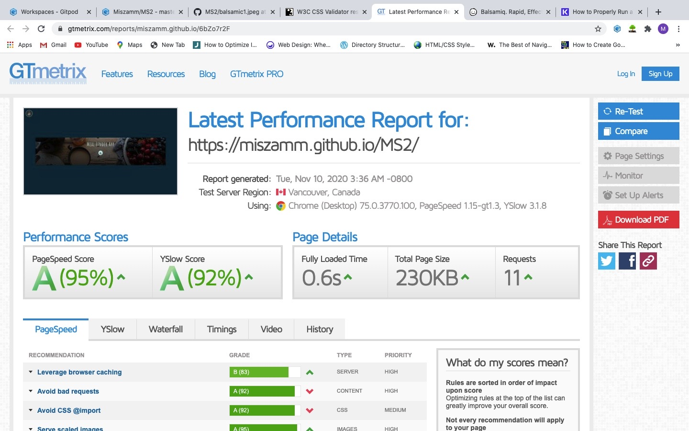
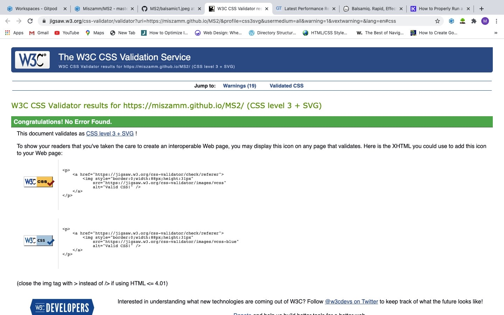

  

<h1>Table of content:</h1>

1. Description
2. Deployment and Demo
3. Wireframe
4. UX
5. Visual Identity
6. User Stories
7. Testing
8. Scalability
9. Technologies
10. Media
11. Thanks to
12. License

# 1. Description

*This is a Meal Finding APP*

> Meal Finding App is all about fantastic food recipes generated instantly, providing you not only wwith pictures,
 ingridients list, methods, allergens and calories but also with wide macronutrient data for those with 
 special reqirements in terms of diet or performance. 

# 2. Deployment and Demo

Website has been deployed to [GitHub Pages](https://miszamm.github.io/MS2/).

The process for deployment is documented below:

Log into GitHub

Access the page with the repository for this project (https://miszamm.github.io/MS2/)

Click on 'Settings' on the main menu over the file listing

Navigate down to 'GitHub Pages'

Select 'Branch: Master' from the menu

This generates a live link for the website, which is now viewable publicly

# 3. Wireframe

The wireframe was designed using [Balsamiq](https://balsamiq.com/) and links to the final version can be found below:

- 

- 

# 4. UX

I have opted to a simple and responsive design which is lightweight and has a loading time of around 0.6 second.

- Home Page with minimalistic design contains body with logo div, and main section, with single colour background, and picture of food 
  in the center off the viewport to contrast the background colour. Main Page is responsive despite the size of the device. Animated search form with button is located above the main photo. 
  Name of the app placed above search form as expected.
- Once search form is filled in and button pressed, than main foto is removed and replaced with data recieved from Api, and search-outcome is 
  dispalay in the viewport by using css grid template to define grid columns and rows. 
- API used comes from [EDAMAM](https://developer.edamam.com/) and contains in it's data base almost 2 milion recipes. 
  As a developer you are allow free access, with 5 requests form API per minute.
- Displayd data contains an image of searched meal or ingriedient and additional dietary informations. 
- For a full recipe and method user would be redirected to the original page by pressing a button "see recipe" located on the right side below the picture from generated HTML.
- For better user experience if the data is not find, script.js will generate alert to retype search value.

In order to improve user experience and website loading speed, I have compressed the images using [tinypng.com](https://tinypng.com/) and the reduction in image size has been 51%.

# 5. Visual Identity

- [Free Logo Design](http://freelogodesign.org) for the logo design and stationary

# 6. User Stories

Users:

- As a user, I'd like to find meals from different parts of the world,
- As a user, I'd like to get inspiration or new ideas for meal preping
- As a user, I'd like to get dietary informations about products or meals
- As a user, I'd like to find nutrition values of the food to improve  performance in sport
- As a user, I'd like to get nutritional guidlines  

Meal Finder App owner:

- As a business owner, I'd like to list other services in the site
- As a business owner, I'd like to receive legal advice on certain issues
- As a business owner, I'd like to access the members area
- As a business owner, I'd like to connect with other businesses in my area, or globaly

# 7. Testing

Website has been tested using [GTmetrix](https://gtmetrix.com/reports/miszamm.github.io/6bZo7r2F) and [W3C CSS Validator](https://jigsaw.w3.org/css-validator/validator?uri=https%3A%2F%2Fmiszamm.github.io%2FMS2%2F&profile=css3svg&usermedium=all&warning=1&vextwarning=&lang=en#css), see results below:

The points below can be improved with a bit more optimization:

- Serving scaled images (some images are being resized in CSS e.g. logo.png)
- Leveraging browser caching
- When I did this test, css/theme.css returned a 404 (Imispelled Theme.css)

# 8. Scalability

Using a back-end programming language and database, I'd like to have a fully featured CMS which can be used by non-technical people to create, read, update and delete data easily.

Also, I'd like franchise owners to have a private section where they can find resources and talk directly to our customer service representatives.

# 9. Technologies
- [HTML](https://html.com/)
- [CSS](https://developer.mozilla.org/en-US/docs/Web/CSS)
- [JavaScript](https://www.javascript.com/)
- [jQuery](https://jquery.com/)

# 10. Media

I have used different resources for images and my logo, I'll list all below:

- [Free Logo Design](http://freelogodesign.org) for the logo design and stationary
- [Unsplash](https://unsplash.com) for all the images
- [Font Awesome](https://fontawesome.com/6?next=%2Fstart) for the amazing icons used on this site
- [Am I Responsive](http://ami.responsivedesign.is/) for the cool image in the UX section
- [MDN Web Docs](https://developer.mozilla.org/en-US/) for technical suport

# 11. Thanks to:
- Gitpod Since I am typing this text through Gitpod. All code was created through Gitpod and the workspace for this project resides there.
- GitHub which is used to host and deploy the project
- Font awesome community for developing this great resource
- Bootstrap crew for developing and maintaining such great library although in the end i didn't use it
- jQuery developers for all the work and great documentation
- Free Logo Design for the great service
- Unsplash.com for the wonderful pictures
- Microsoft for developing VScode and providing it free of charge
- Brooke Lark and Dan Gold for taking andsharing great photos 
- EDAMAM for allowing use of their API for the project 
- Traversy Media, Academind, and Dark Code for sharing their proffesional knowledge
- Code Institute team: the other students on Slack
- Last but not least my mentor Felipe Souza Alarcon for his constant support, and proffesional advice

# 12. License

This project is licensed under the [MIT](https://choosealicense.com/licenses/mit/) license.

MIT License

Copyright (c) 2020 Michal Misza

Permission is hereby granted, free of charge, to any person obtaining a copy of this software and associated documentation files (the "Software"), to deal in the Software without restriction, including without limitation the rights to use, copy, modify, merge, publish, distribute, sublicense, and/or sell copies of the Software, and to permit persons to whom the Software is furnished to do so, subject to the following conditions:

The above copyright notice and this permission notice shall be included in all copies or substantial portions of the Software.

THE SOFTWARE IS PROVIDED "AS IS", WITHOUT WARRANTY OF ANY KIND, EXPRESS OR IMPLIED, INCLUDING BUT NOT LIMITED TO THE WARRANTIES OF MERCHANTABILITY, FITNESS FOR A PARTICULAR PURPOSE AND NONINFRINGEMENT. IN NO EVENT SHALL THE AUTHORS OR COPYRIGHT HOLDERS BE LIABLE FOR ANY CLAIM, DAMAGES OR OTHER LIABILITY, WHETHER IN AN ACTION OF CONTRACT, TORT OR OTHERWISE, ARISING FROM, OUT OF OR IN CONNECTION WITH THE SOFTWARE OR THE USE OR OTHER DEALINGS IN THE SOFTWARE.